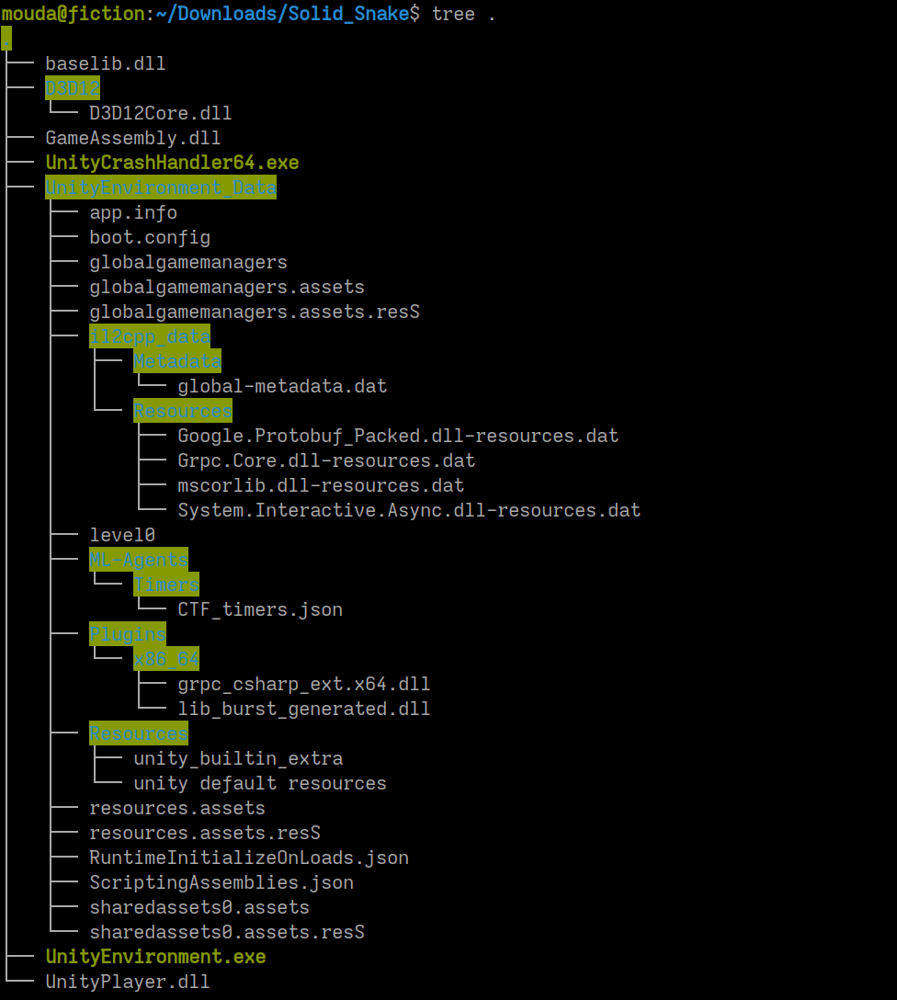
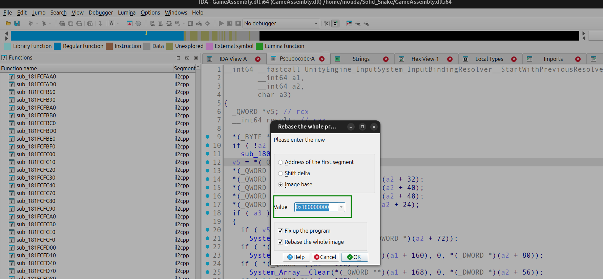
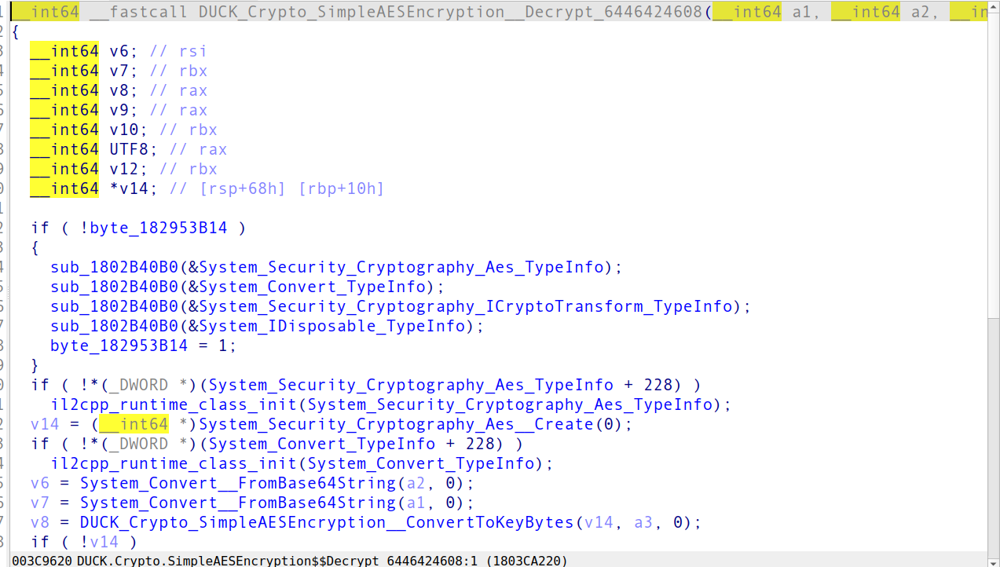
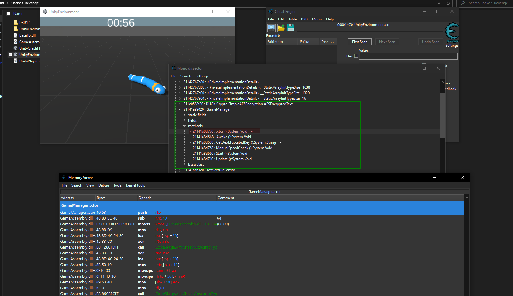
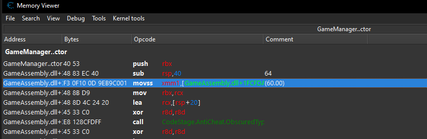
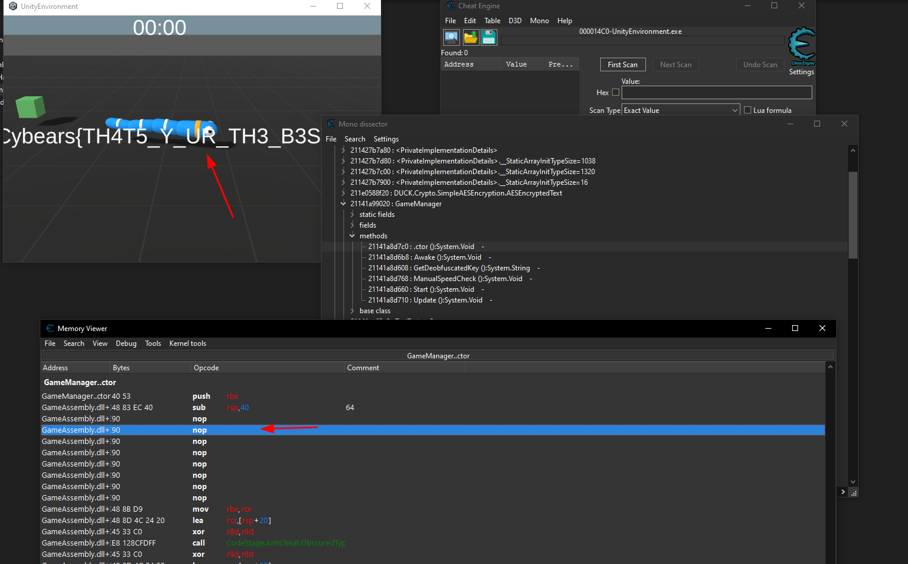

## Solid Snake and Snake's Revenge - Writeup

I usually hate game reversing, but this time I took it as an opportunity to learn.

### Understanding the Game Structure



This is a **Unity IL2CPP** build:
- `GameAssembly.dll` - compiled C# code (native, not .NET)
- `il2cpp_data/Metadata/global-metadata.dat` - IL2CPP type metadata

IL2CPP converts C# → C++ → native code at build time, making it harder to reverse than traditional Mono builds.

### Initial Analysis with Il2CppDumper
```bash
./Il2CppDumper GameAssembly.dll \
  UnityEnvironment_Data/il2cpp_data/Metadata/global-metadata.dat ./dump
```

This extracts `dump.cs` with class definitions and RVA offsets. The binary was huge, so I searched for interesting strings and found:
- `DUCK.Crypto.SimpleAESEncryption` - AES encryption
- `GameManager` - main game logic



After rebasing the binary in IDA, I jumped to the decrypt function:



I tried hooking with Frida to intercept values but couldn't get it working (skill issue). Time to try Cheat Engine instead.

---

## Part 1: Solid Snake

Simple snake game - keep dying. Flag appears on win.

**Solution: Speedhack**
1. Attach Cheat Engine
2. Enable speedhack (speed 500x)
3. Win 


---

## Part 2: Snake's Revenge

Same game, but speedhack crashes:
```
Error: monoscript.lua:4109: attempt to index a nil value
  in function 'mono_invoke_method'
```

### Diffing Both Versions
```bash
diff -rq Solid_Snake/ Snake\'s_Revenge/
```

Key differences:
- `GameAssembly.dll` - 7KB smaller (anti-cheat added)
- `ML-Agents` folder - removed

### Understanding CE's Mono Dissector + IL2CPP

Important: Cheat Engine's Mono dissector can **parse** IL2CPP metadata and display classes, but it **cannot execute** Mono functions since there's no Mono runtime. That's why speedhack crashes - it tries to call `mono_invoke_method()` which doesn't exist.

### The Real Solution

Using CE's Mono features ([wiki](https://wiki.cheatengine.org/index.php?title=Mono)), we can still hook methods via JIT:





My approach:
1. Break at `GameManager.ctor`
2. NOP the time check instruction




---
Thank you !

M0ud4