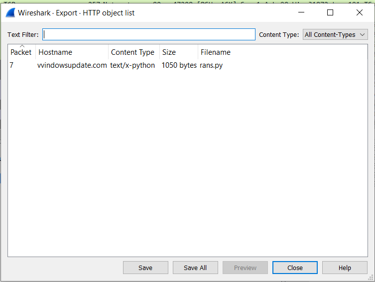
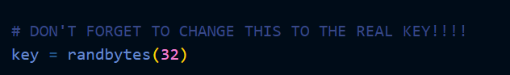
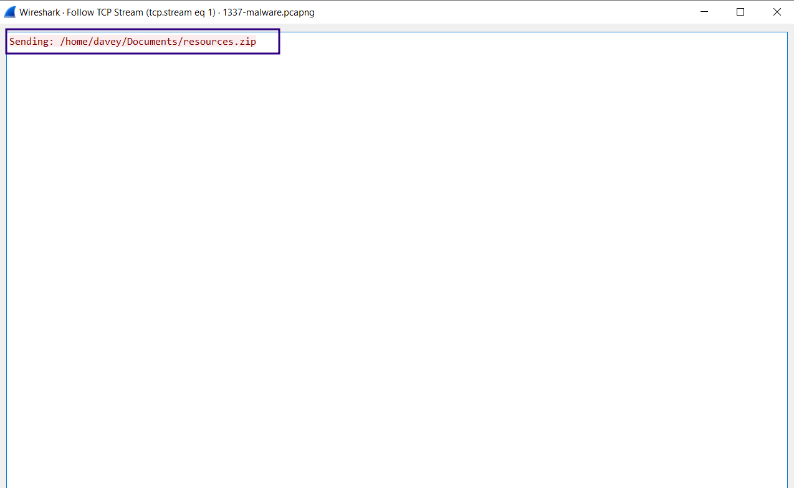
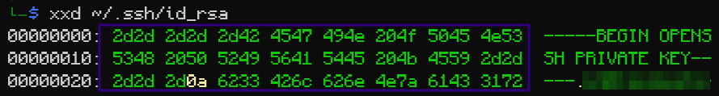
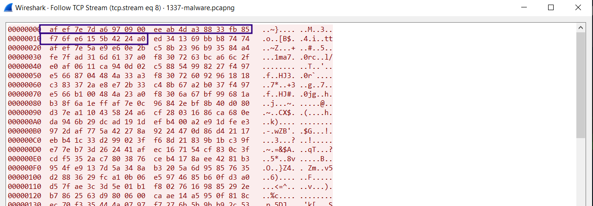
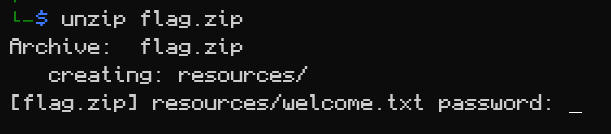
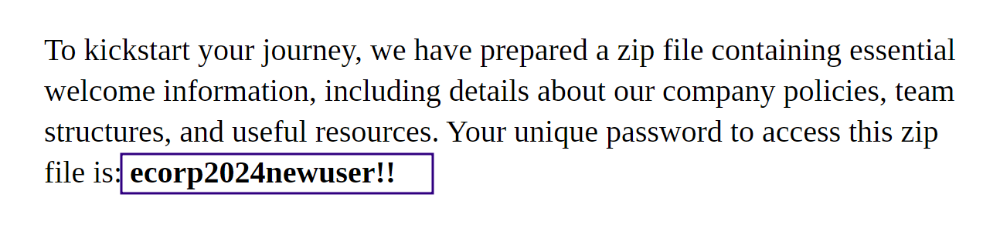
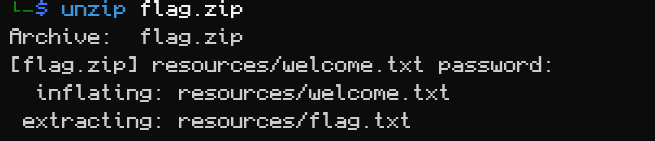
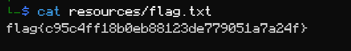

# 1337 Malware Writeup
This task is talking about what seems to be a network capture for a broken ransomware communication with it's C&C.
## Lets extract the ransomware code :

The python script is pretty simple :

reads the files in certain path --> generate a random key --> encrypt the files and send them to C&C (Command and control)

## Breaking the xor Implimentation:
Key here is a random 32 bytes.

We can see from the pcap that various files have been sent (pdf,png,zip,public key,private key), following it the enc content

--> The idea here is to find a fixed 32 bytes header in any of this extensions so we can xor it with encrypted file and restore the key 

original ^ key = enc

enc ^ original = Key 

As we can see here the ssh private key header is over 32 bytes , bingus 

Enc Sent Header :

Look for scripts/xor_break.py to see how i recovered the key . 

Now simply you can try to decrypt the zip file : 

We can see the flag.txt we need the password now , lets decrypt the pdf it may contain the password .

## Extracting the flag 

