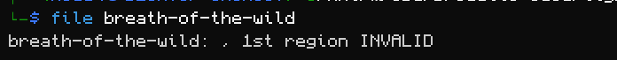
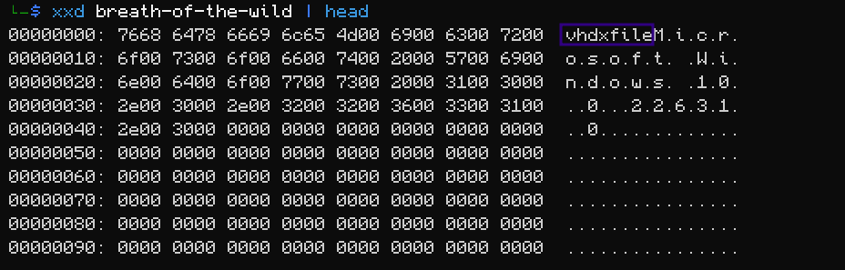
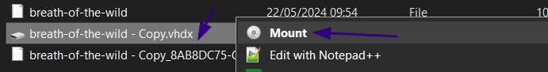
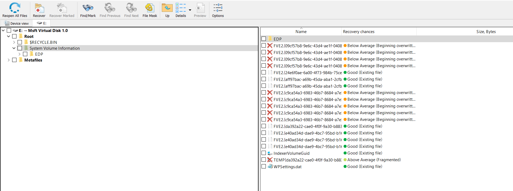
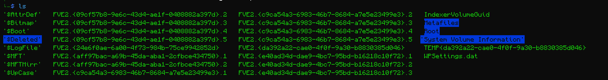
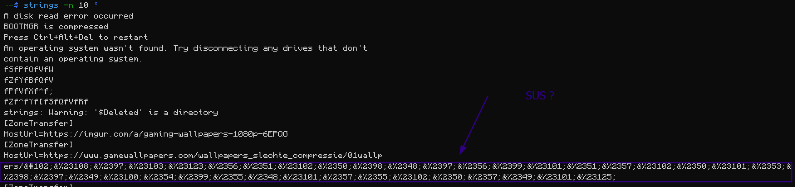
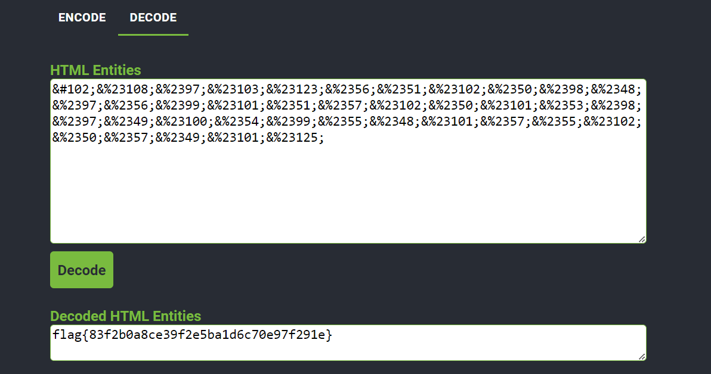

## Breath of The Wild Writeup
First Analysis on the file shows that its a vhdx file (virtual Hard disk)

We probably need to resotre some regions of this disk.

Simply what i did is to change the file to .vhdx entension and mount it using windows prebuilt function:

Taking a glance at the mounted disk dosent seem to have much other than random pics.

For This kind of task i usually use R-studio to try to recover some parts of the disk.

Lets Restore all and see what is gives.

A weird Html Chars appeared in the strings , let's decode and see :

Well it's the flag :smile: