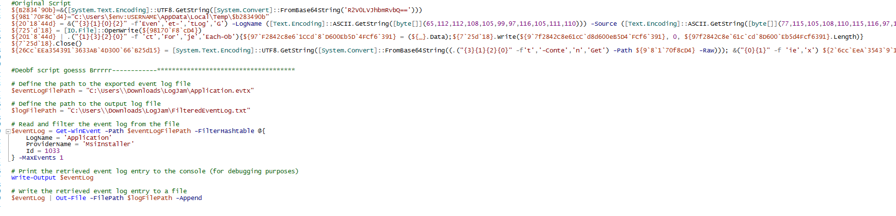

# Logjam Writeup 
Analyzing the Update Link we can see this:

It appears to be installing a kind of agent or malware

It seems to be a obf powershell script , after some deobf we can habe this result :

#We'll Complete this laster This day too