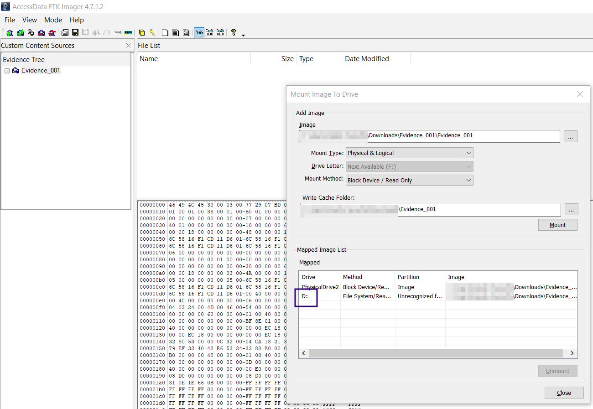
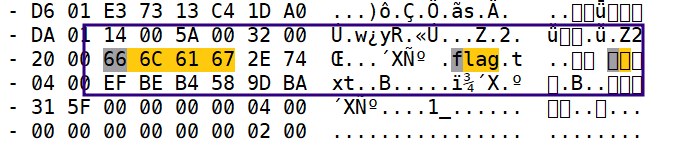
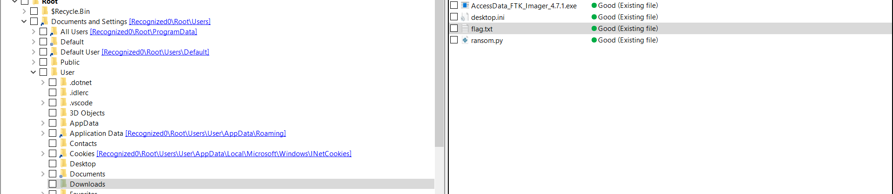
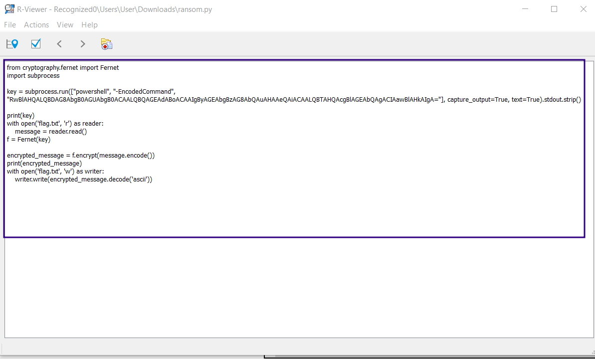
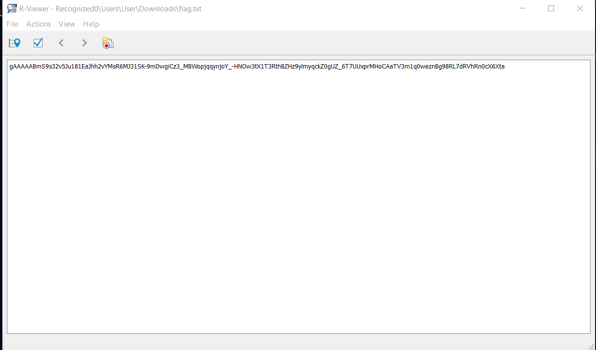
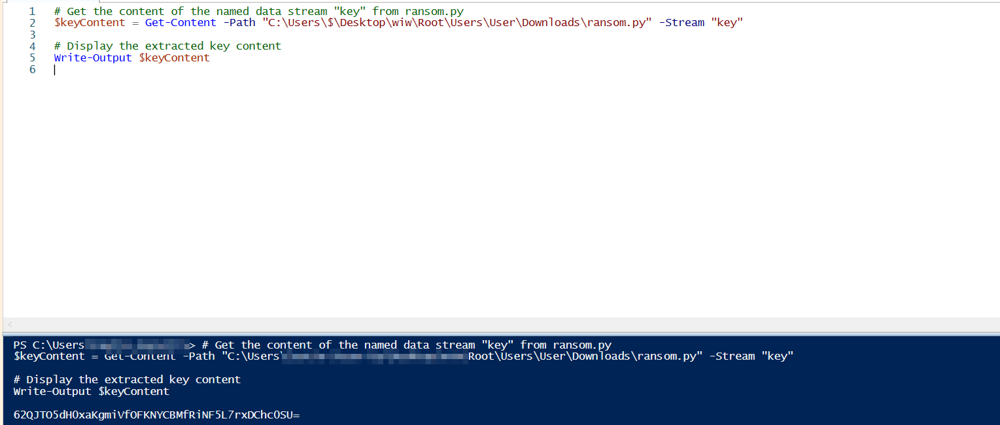
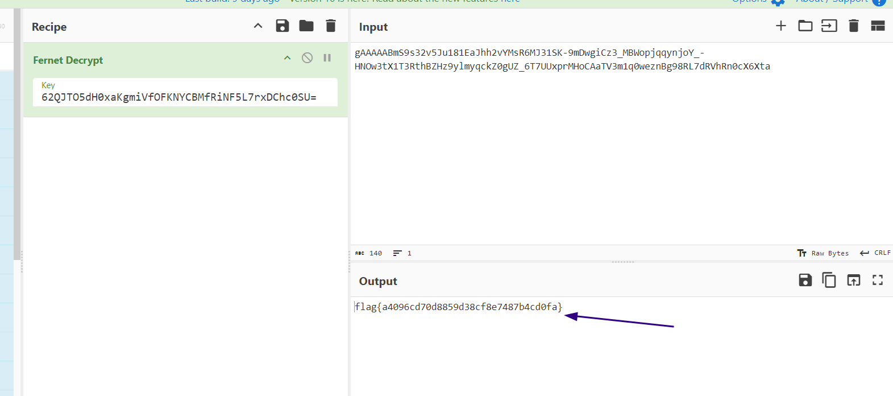

# Taking Up Residence Writeup 

My methodology Here is to mount the file to a H/V disk and then using R-studio to explore the restored mft sectors.

Exploring the secotrs we can Obv see an existance of flag.txt  and a ransom.py

Flag is getting encrypted with Fernet method , they key is getted via Get-Content -Path and the '-stram' ntfs function
Let's Try to simulate it and retreive the key 

We have everything now , lets decrypt:
