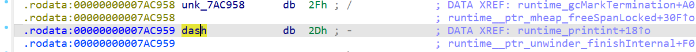
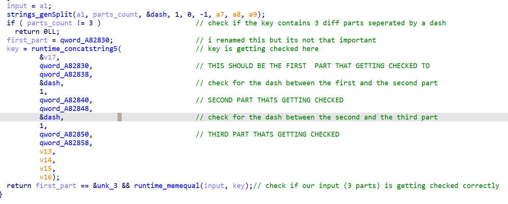
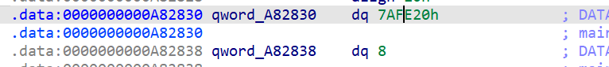
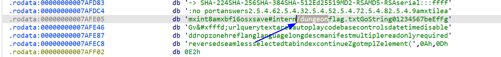
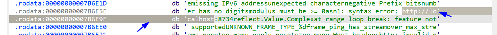
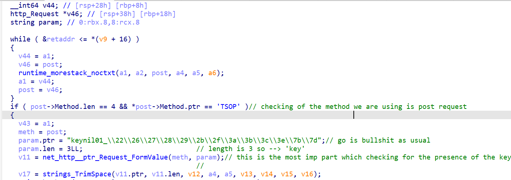
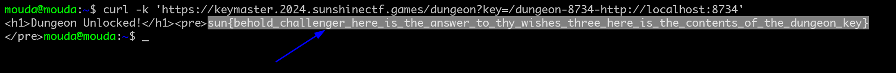

# Sunshine CTF 2024 (by M0ud4)

## Dungeon Key Master

### Challenge Overview

We are provided with a Go binary that we will reverse engineer using static analysis in IDA. The goal is to find a valid key, which involves analyzing two main functions responsible for the key checks.

### Key Retrieval Overview

The challenge requires understanding the structure of the key, which consists of three parts separated by dashes (`-`). 

---

## Reversing the Binary: The `main_checkKey` Function

This is the core function where two main operations take place:

### 1. `genSplit` Function – Checking Key Structure

The first check involves splitting the input key into three parts using the dash (`-`) as a delimiter.



The program ensures that the key consists of three parts, separated by dashes. The next step is to verify each part.

### 2. `Runtime_concatstring5` – Key Part Validation

The second check is more significant, as it verifies whether the key parts match specific values. 



#### String Comparison Breakdown

To better understand the logic, I manually undefined the string offsets in IDA (using the 'o' key in the data view) for a clearer representation.

---

## Detailed Breakdown of Key Parts

### First Key Part Check

The first part of the key is extracted and compared against 8 bytes from the data section.



The extracted value corresponds to the string `"/dungeon"`.

### Second Key Part Check

The second check compares the next 4 bytes from the data section.



This results in the string `"8734"`, which is the port number the app is running on.

### Third Key Part Check

The final check involves comparing 21 bytes from the data section.



This corresponds to the string `"http://localhost:8734"`, which represents the URL of the local server.

---

## The Complete Key

Based on the above analysis, we can construct the complete key as follows:

/dungeon-8734-http://localhost:8734

---

## Getting the Flag

Now that we have the correct key, lets retrieve the flag. The binary contains a form-handling function called `mainHandle_form`


The function is checking for the post req and ensuring that the key param is getting passed in the url 

### Submitting the Key


```bash
curl --insecure -X POST "https://keymaster.2024.sunshinectf.games/dungeon?key=/dungeon-8734-http://localhost:8734"

```


```
THATS IT FOR TODAY I HOPE U LEARNED SOMETHING NEW (M0ud4) 
``` 